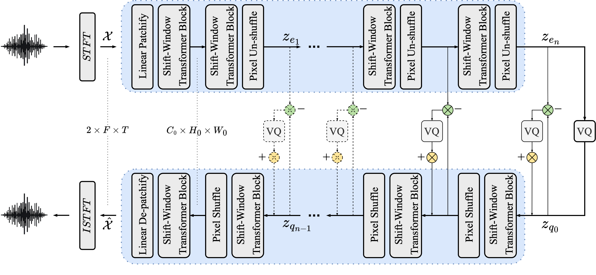

# ESC: High-Fidelity Speech Coding with Efficient Cross-Scale Vector Quantized Transformers

This is the code repository for the Efficient Speech Codec presented in the paper [ESC: High-Fidelity Speech Coding with Efficient Cross-Scale Vector Quantized Transformers](https://drive.google.com/file/d/1QqqgoAb5qB8GJcD_IWiUepMsfkoLEdYS/view?usp=sharing)



### Training

Use the following script to train a swin transformer-based cross-scale multiscale audio codec.

```{python}
python src/main.py \
    --config residual_18k.yml \
    --seed 53 \
    --wb_exp_name swin-18k-residual \
    --wb_project_name Neural_Speech_Coding \
    --num_epochs 80 \
    --lr 1.0e-4 \
    --train_bs_per_device 60 \
    --test_bs_per_device 16 \
    --num_device 4 \
    --parallel dp \
    --num_worker 4
```

````{=html}
<!-- ### Inference

Use the following script to make a compression inference.

```{python}
python eval/test_codec.py \
        --model_path model_dir \
        --device "cpu" \
        --source test/instance1.wav \
        --multiscale \
        --kbps 18 \
        --output_dir test
```

You can specify a fixed bitrate by removing ---multiscale and set ---kbps from [3, 6, 9, 12, 15, 18] -->
````

```{=html}
<!-- ### Results

Our Codec performance evaluated over DNS-Challenge Dataset is plotted below. We compared our swin-based codec with Jiang et, al. (2022), who invented the cross-scale vector quantization schema that has inspired our work.


You can also investigate a test instance of our codec [here](https://western-spatula-93a.notion.site/Swin-T-Cross-Scale-Audio-Codec-Evaluated-Instances-b9cf99937b794973a95344d834f594a8?pvs=4), where we provide multi-scale reconstructed audios, as well as spectrogram plots with metrics specified. -->
```
